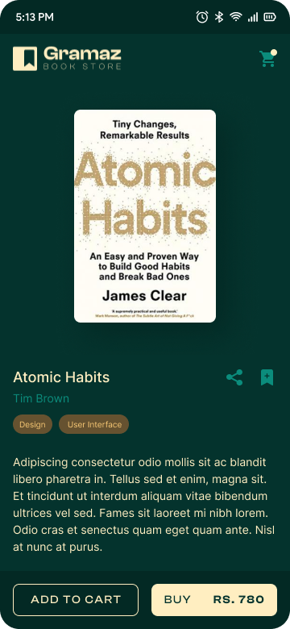

# Gramaz: A Flutter Book App

**Gramaz** is a beautifully designed mobile app for book enthusiasts, built using Flutter. It allows users to explore, search, and save their favorite books, with a seamless browsing experience. The app integrates with an API to fetch detailed book information and provides a smooth, responsive user interface.

## Features

* **Book Browsing:** Discover a wide range of books, with details like title, author, description, and cover image.
* **Search Functionality:** Quickly find books by title, author, or genre.
* **Favorites:** Save books to your favorites list for quick access later.
* **Book Details:** View detailed information about each book, including summaries, reviews, and ratings.
* **Responsive UI:** A clean and modern user interface that adapts to any screen size.

## Technologies

* **Flutter:** Google's UI toolkit for building natively compiled applications for mobile, web, and desktop from a single codebase.
* **Dart:** Programming language optimized for building cross-platform apps with Flutter.
* **Bloc:** State management for predictable and scalable app states.
* **MVVM Pattern:** Ensures a clear separation of concerns and a more maintainable codebase.
* **API Integration:** Fetch book data from [Book API] for real-time updates.

## Screenshots

| Splash Screen       | Home Screen        | Book Details Screen       |
| ----------------- | ------------------ | ---------------------- |
|  |  |  |

## Getting Started

### Prerequisites
* Flutter SDK (version 3.0 or higher)
* Dart SDK (version 2.0 or higher)
* Firebase account for authentication and real-time database
* A code editor like VSCode or Android Studio

### Installation


1. Clone the repository:
   ```bash
   git clone [the repo url]
2. Navigate to the project directory:
   ```bash
   cd grammaz_app
3. Install dependencies:
   ```bash
   flutter pub get

4. Run the app on an emulator or physical device::
   ```bash
   flutter run

### Contributing
We welcome contributions to AL24News! Please refer to our contribution guidelines for details.

### License
This project is licensed under the raufzer license.
